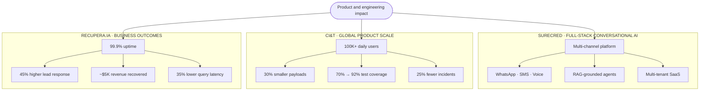
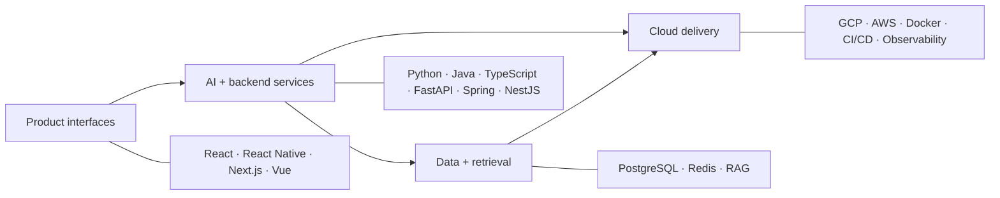

<div align="center">

# Matheus Francisco

### Full-Stack AI Engineer

**I build production AI platforms from user interface to model behavior,
infrastructure and observability.**

`Conversational AI` · `Distributed Systems` · `Cloud-Native SaaS`

<a href="./assets/ai-system-flow.svg" title="Open the production AI system flow">
  
</a>

<sub>Channel → context → reasoning → tools → observable outcome</sub>

[](https://matheus.dev)
[](<./Curriculo_Matheus_Francisco_En (1).pdf>)
[](https://www.linkedin.com/in/matheus-francisco0/)
[](mailto:math.francisco2@gmail.com)
[](#)

</div>

---

## Production impact


```mermaid
flowchart TB
    Impact([Product and engineering impact])

    Impact --> C0
    Impact --> S0
    Impact --> G0

    subgraph Current["SURECRED · FULL-STACK CONVERSATIONAL AI"]
        direction LR
        C0["Multi-channel platform"]
        C1["WhatsApp · SMS · Voice"]
        C2["RAG-grounded agents"]
        C3["Multi-tenant SaaS"]
        C0 --> C1
        C0 --> C2
        C0 --> C3
    end

    subgraph Scale["CI&T · GLOBAL PRODUCT SCALE"]
        direction LR
        S0["100K+ daily users"]
        S1["30% smaller payloads"]
        S2["70% → 92% test coverage"]
        S3["25% fewer incidents"]
        S0 --> S1
        S0 --> S2
        S0 --> S3
    end

    subgraph Growth["RECUPERA.IA · BUSINESS OUTCOMES"]
        direction LR
        G0["99.9% uptime"]
        G1["45% higher lead response"]
        G2["~$5K revenue recovered"]
        G3["35% lower query latency"]
        G0 --> G1
        G0 --> G2
        G0 --> G3
    end
```

<div align="center">

**AI delivery · product scale · measurable business outcomes**

</div>

## What I am building now

```text
ROLE            Full-Stack Software Engineer — Conversational AI
PRODUCT         Multi-tenant conversational AI SaaS
EXPERIENCE      Product UI · APIs · AI agents · data · cloud operations
CHANNELS        WhatsApp · SMS · Voice AI
SYSTEM          Python · Flask · GCP · RAG · PostgreSQL · Docker
```

At Surecred, I own end-to-end delivery across a full-stack platform for
automated credit recovery. I work across product interfaces, backend
architecture, model behavior, messaging providers, voice integrations,
multi-tenant data and the operational tooling required to understand and
control the automation.


```mermaid
flowchart LR
    Customer((Customer))

    subgraph Channels
        WA[WhatsApp]
        SMS[SMS]
        Voice[Voice AI]
    end

    subgraph Platform["Conversational AI platform"]
        UI[Product + operator UI]
        API[Platform APIs]
        Gateway[Channel gateway]
        Context[Context + tenant data]
        Agent[LLM agent]
        Guardrails[Policies + guardrails]
        Tools[Business tools]
    end

    subgraph Operations
        Data[(PostgreSQL / RAG)]
        Observe[Logs, traces + evaluation]
        Human[Human recovery path]
    end

    Customer --> WA
    Customer --> SMS
    Customer --> Voice
    UI --> API
    API --> Gateway
    WA --> Gateway
    SMS --> Gateway
    Voice --> Gateway
    Gateway --> Context --> Agent
    Guardrails -. constrains .-> Agent
    Agent <--> Data
    Agent --> Tools --> Customer
    Gateway --> Observe
    Agent --> Observe
    Tools --> Observe
    Agent -. escalate .-> Human
```

> I treat the model as one component. Production trust comes from explicit
> boundaries, observable decisions and recoverable paths around it.

## Selected engineering outcomes

<table>
  <tr>
    <td width="50%" valign="top">
      <strong>Full-stack AI platform</strong>
      <br /><br />
      Own product interfaces, platform APIs, AI behavior, multi-tenant data and
      cloud delivery for conversational credit recovery across WhatsApp, SMS
      and voice.
    </td>
    <td width="50%" valign="top">
      <strong>Voice AI and grounded behavior</strong>
      <br /><br />
      Shipped an ElevenLabs SIP/BYOC outbound agent and implemented RAG over
      domain knowledge to improve relevance and reduce hallucinations.
    </td>
  </tr>
  <tr>
    <td width="50%" valign="top">
      <strong>Scalable product delivery</strong>
      <br /><br />
      Delivered React and React Native applications supporting more than
      100,000 daily active users across multiple regions.
    </td>
    <td width="50%" valign="top">
      <strong>Reliability and performance</strong>
      <br /><br />
      Increased test coverage from 70% to 92%, reduced production incidents by
      25% and improved database query latency by 35%.
    </td>
  </tr>
</table>

<div align="center">

[](https://matheus.dev/work)
[](https://matheus.dev/system-design)

</div>

## Featured technical work

| System | Engineering focus | Explore |
| --- | --- | :---: |
| Multi-channel AI agent | Latency, safety, tools and observability | [Case study →](https://matheus.dev/work/production-ai-collections-agent) |
| Reliable messaging | Idempotency, provider semantics and throttling | [Case study →](https://matheus.dev/work/resilient-multi-channel-messaging) |
| Model routing | Dynamic reasoning, context caching and evaluation | [Case study →](https://matheus.dev/work/llm-model-routing-cost-architecture) |
| AI system catalog | Architecture diagrams and short explanations | [View systems →](https://matheus.dev/system-design) |

## Core stack

<details open>
<summary><strong>AI and backend</strong></summary>

<br />


</details>

<details>
<summary><strong>Frontend and product interfaces</strong></summary>

<br />


</details>

<details>
<summary><strong>Data, cloud and delivery</strong></summary>

<br />


<br />

`Distributed Systems` · `DDD` · `Clean Architecture` · `Microservices` ·
`BFF` · `REST APIs` · `GraphQL` · `TDD` · `SOLID` · `Code Review` ·
`CI/CD` · `Observability`

</details>


```mermaid
flowchart LR
    Product[Product interfaces]
    Services[AI + backend services]
    Data[Data + retrieval]
    Cloud[Cloud delivery]

    Product --> Services --> Data
    Services --> Cloud
    Data --> Cloud

    Product --- P[React · React Native · Next.js · Vue]
    Services --- S[Python · Java · TypeScript · FastAPI · Spring · NestJS]
    Data --- D[PostgreSQL · Redis · RAG]
    Cloud --- C[GCP · AWS · Docker · CI/CD · Observability]
```

## Experience and education

<table>
  <tr>
    <td width="50%" valign="top">
      <strong>Experience</strong>
      <br /><br />
      <strong>Surecred</strong> — Full-stack conversational AI platform<br />
      <strong>CI&T</strong> — Global web and mobile products<br />
      <strong>Recupera.IA</strong> — AI-driven sales recovery SaaS<br />
      <strong>Unimed</strong> — Medical and financial operations
    </td>
    <td width="50%" valign="top">
      <strong>Education</strong>
      <br /><br />
      B.Sc. Artificial Intelligence — UNIVESP<br />
      Systems Analysis and Development — UNIFEOB<br />
      Technical Degree in Electronics
    </td>
  </tr>
</table>

## GitHub snapshot

<div align="center">

<picture>
  <source
    media="(prefers-color-scheme: dark)"
    srcset="https://github-readme-stats.vercel.app/api?username=mathfrancisco&show_icons=true&hide_border=true&bg_color=00000000&title_color=C9A227&icon_color=4FB17E&text_color=E7E7E2"
  />
  <source
    media="(prefers-color-scheme: light)"
    srcset="https://github-readme-stats.vercel.app/api?username=mathfrancisco&show_icons=true&hide_border=true&bg_color=00000000&title_color=8C6F1C&icon_color=2F8F5B&text_color=16161A"
  />
  
</picture>

<picture>
  <source
    media="(prefers-color-scheme: dark)"
    srcset="https://github-readme-stats.vercel.app/api/top-langs/?username=mathfrancisco&layout=compact&hide_border=true&bg_color=00000000&title_color=C9A227&text_color=E7E7E2&langs_count=8"
  />
  <source
    media="(prefers-color-scheme: light)"
    srcset="https://github-readme-stats.vercel.app/api/top-langs/?username=mathfrancisco&layout=compact&hide_border=true&bg_color=00000000&title_color=8C6F1C&text_color=16161A&langs_count=8"
  />
  
</picture>

<br />

</div>

## Let's connect

Based in São Paulo, Brazil (UTC-3) and open to remote software engineering
opportunities involving AI systems, backend architecture, full-stack products
and cloud-native applications.

<div align="center">

[](https://matheus.dev)
[](https://www.linkedin.com/in/matheus-francisco0/)
[](mailto:math.francisco2@gmail.com)

</div>

---

<div align="center">

**Building AI systems that remain understandable when production gets messy.**

</div>
