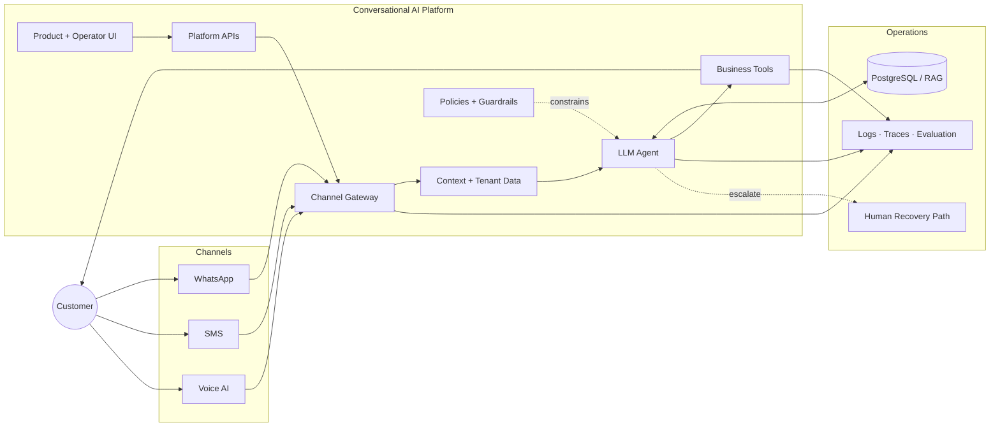

<div align="center">

# Matheus Francisco

### Software Engineer · Java · Spring Boot · Full Stack · AI Engineering

**Building reliable software — from distributed backends and product interfaces  
to production AI systems.**

`Java` · `Spring Boot` · `TypeScript` · `React` · `Microservices` · `AI/LLM` · `Cloud`

[](https://portifolio-ia-nine.vercel.app)
[](https://portifolio-ia-nine.vercel.app/cv.pdf)
[](https://www.linkedin.com/in/matheus-francisco0/)
[](mailto:math.francisco2@gmail.com)
[](#)

</div>

---

## About me

I'm a **Software Engineer focused on Java, Spring Boot and full-stack development**, with hands-on experience building and integrating production systems across backend services, web applications, mobile products and cloud environments.

I work with **Java/Spring Boot, TypeScript, React, React Native, Next.js and NestJS**, designing APIs, BFFs, integrations and reusable application layers for production systems.

I also build **AI-powered products** using Python, FastAPI, LLM agents, RAG and conversational AI, with a strong focus on reliability, observability, guardrails and maintainable architecture.

My engineering interests include **distributed systems, microservices, API design, software architecture, cloud-native applications and production AI systems**.

---

## Featured projects

| Project | Stack / focus | What it demonstrates |
| --- | --- | --- |
| [URL Shortener](https://github.com/mathfrancisco/URL-Shortenere) | Java · Spring Boot · Angular · MySQL · Docker · AWS | Full-stack architecture, REST APIs, persistence and cloud deployment |
| [LiveChat](https://github.com/mathfrancisco/LiveChat-App) | Java · Spring Boot · WebSocket · STOMP · Angular | Real-time communication, event-driven features and client/server integration |
| [Multi-channel AI Agent](https://portifolio-ia-nine.vercel.app/work) | Python · LLM · RAG · Voice AI · Messaging | Production conversational AI, tools, safety and observability |
| [Reliable Messaging](https://portifolio-ia-nine.vercel.app/work) | Messaging · Idempotency · Throttling | Provider integration, reliability and failure-aware delivery |
| [Model Routing](https://portifolio-ia-nine.vercel.app/work) | LLM routing · Context caching · Evaluation | Cost-aware AI architecture and model orchestration |
| [AI System Designs](https://portifolio-ia-nine.vercel.app/system-design) | Architecture · Retrieval · Agents · Evaluation | System-design diagrams and engineering trade-offs |

---

## What I work with

```text
BACKEND         Java · Spring Boot · TypeScript · NestJS · Python · FastAPI
FRONTEND        React · React Native · Next.js · Angular · Vue
ARCHITECTURE    Microservices · BFF · REST · GraphQL · Distributed Systems
AI              LLM Agents · RAG · Conversational AI · Voice AI · Guardrails
DATA            PostgreSQL · Redis · MySQL
CLOUD           AWS · GCP · Docker · Kubernetes · CI/CD · Observability
ENGINEERING     DDD · Clean Architecture · SOLID · TDD · Code Review
```

---

## Production engineering

### CI&T — Software Engineer

I work on enterprise payment products across web, mobile and backend integrations.

My work includes:

- Building web and mobile features with **React, React Native, Next.js and TypeScript**.
- Developing **REST and GraphQL BFF services with NestJS**.
- Integrating applications with **Java/Spring Boot microservices**.
- Reviewing API contracts, OpenAPI specifications, pagination and security behavior before implementation.
- Implementing **role-based access control with Azure AD** across frontend and BFF layers.
- Extracting reusable payment-domain logic into shared libraries for web and mobile applications.
- Participating in technical refinements, architecture discussions, code reviews, unit testing and CI/CD.
- Working with **GitLab CI, Docker, Kubernetes and Datadog** in production delivery workflows.

### Production AI systems

I have also worked on a **multi-tenant conversational AI platform** for automated credit recovery across **WhatsApp, SMS and Voice AI**.

The platform work spans product interfaces, APIs, AI-agent behavior, retrieval, messaging integrations, multi-tenant data and cloud operations.


```mermaid
flowchart LR
    Customer((Customer))

    subgraph Channels
        WA[WhatsApp]
        SMS[SMS]
        Voice[Voice AI]
    end

    subgraph Platform["Conversational AI Platform"]
        UI[Product + Operator UI]
        API[Platform APIs]
        Gateway[Channel Gateway]
        Context[Context + Tenant Data]
        Agent[LLM Agent]
        Guardrails[Policies + Guardrails]
        Tools[Business Tools]
    end

    subgraph Operations
        Data[(PostgreSQL / RAG)]
        Observe[Logs · Traces · Evaluation]
        Human[Human Recovery Path]
    end

    Customer --> WA
    Customer --> SMS
    Customer --> Voice

    UI --> API
    API --> Gateway

    WA --> Gateway
    SMS --> Gateway
    Voice --> Gateway

    Gateway --> Context
    Context --> Agent

    Guardrails -. constrains .-> Agent

    Agent <--> Data
    Agent --> Tools
    Tools --> Customer

    Gateway --> Observe
    Agent --> Observe
    Tools --> Observe

    Agent -. escalate .-> Human
```

> I treat the model as one component of the system. Production trust comes from explicit boundaries, observable decisions and recoverable paths around it.

---

## Selected engineering outcomes

<table>
  <tr>
    <td width="50%" valign="top">
      <strong>Full-stack product delivery</strong>
      <br /><br />
      Worked across product interfaces, platform APIs, backend integrations and shared application layers for production systems.
    </td>
    <td width="50%" valign="top">
      <strong>Production AI architecture</strong>
      <br /><br />
      Built conversational AI capabilities involving LLM agents, RAG, voice integrations, guardrails, observability and human recovery paths.
    </td>
  </tr>
  <tr>
    <td width="50%" valign="top">
      <strong>Product scale</strong>
      <br /><br />
      Contributed to React and React Native products supporting more than 100,000 daily active users across multiple regions.
    </td>
    <td width="50%" valign="top">
      <strong>Reliability and performance</strong>
      <br /><br />
      Worked on initiatives involving higher test coverage, fewer production incidents and lower database-query latency.
    </td>
  </tr>
</table>

<div align="center">

[](https://portifolio-ia-nine.vercel.app/work)
[](https://portifolio-ia-nine.vercel.app/system-design)

</div>

---

## Core stack

<details open>
<summary><strong>Backend & Software Engineering</strong></summary>

<br />


<br />

`Microservices` · `BFF` · `REST APIs` · `GraphQL` · `Distributed Systems` ·
`DDD` · `Clean Architecture` · `SOLID` · `TDD`

</details>

<details>
<summary><strong>Frontend & Product Interfaces</strong></summary>

<br />


</details>

<details>
<summary><strong>AI Engineering</strong></summary>

<br />


<br />

`Conversational AI` · `Prompt Engineering` · `RAG` · `Tool Use` ·
`Guardrails` · `Evaluation` · `Observability`

</details>

<details>
<summary><strong>Data, Cloud & Delivery</strong></summary>

<br />


<br />

`CI/CD` · `GitLab CI` · `Observability` · `Datadog` · `Cloud-Native Delivery`

</details>

---

## Experience

<table>
  <tr>
    <td width="50%" valign="top">
      <strong>CI&T — Software Engineer</strong>
      <br /><br />
      Enterprise payment products, full-stack delivery, BFFs, API integrations and Java/Spring Boot microservices.
    </td>
    <td width="50%" valign="top">
      <strong>Conversational AI / SaaS Projects</strong>
      <br /><br />
      Full-stack platforms involving Python, LLM agents, RAG, messaging, voice integrations, multi-tenant data and cloud infrastructure.
    </td>
  </tr>
</table>

For my full professional experience:  
[LinkedIn profile](https://www.linkedin.com/in/matheus-francisco0/)

---

## Education

<table>
  <tr>
    <td width="50%" valign="top">
      <strong>B.Sc. in Artificial Intelligence — UNIVESP</strong>
      <br />
      2026–2030
    </td>
    <td width="50%" valign="top">
      <strong>Systems Analysis and Development — UNIFEOB</strong>
      <br />
      Technology degree
    </td>
  </tr>
  <tr>
    <td width="50%" valign="top">
      <strong>Technical Degree in Electronics — IFSP</strong>
    </td>
    <td width="50%" valign="top">
      <strong>Continuous learning</strong>
      <br />
      Backend, cloud, software architecture and AI engineering.
    </td>
  </tr>
</table>

---

## GitHub statistics

<div align="center">


<br />


<br />


<br />


</div>

---

## Let's connect

Based in **São Paulo, Brazil (UTC-3)** and open to remote software engineering opportunities involving **Java/Spring Boot, backend architecture, full-stack products, distributed systems, cloud-native applications and AI-enabled software**.

<div align="center">

[](https://portifolio-ia-nine.vercel.app)
[](https://portifolio-ia-nine.vercel.app/blog)
[](https://www.linkedin.com/in/matheus-francisco0/)
[](mailto:math.francisco2@gmail.com)

</div>

---

<div align="center">

**Building reliable software — from distributed backends to production AI systems.**

</div>
