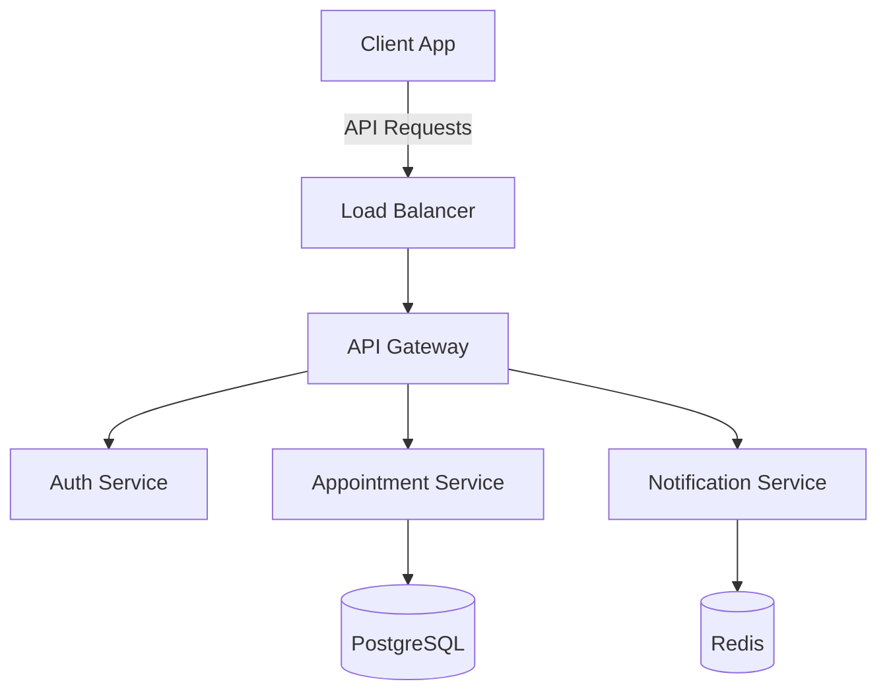

<div align="center">

# 👨‍💻 Matheus Francisco
> **Full Stack Developer | Solution Architect | Cloud Enthusiast**  
> Passionate about building scalable, high-performance applications that drive business success.
[](https://git.io/typing-svg)

[](https://github.com/mathfrancisco)
[](https://badges.pufler.dev)


</div>

<div align="center">

## 🛠️ Tech Stack

#### 🧩 Frontend Technologies
[](https://angular.io/)
[](https://www.typescriptlang.org/)
[](https://developer.mozilla.org/en-US/docs/Web/Guide/HTML/HTML5)
[](https://developer.mozilla.org/en-US/docs/Web/CSS)
[](https://tailwindcss.com/)
[](https://www.javascript.com/)

#### 🛠️ Backend Technologies
[](https://www.java.com/)
[](https://spring.io/)
[](https://nodejs.org/)
[](https://nestjs.com/)
[](https://www.postgresql.org/)
[](https://www.mongodb.com/)

#### ☁️ Cloud & DevOps
[](https://aws.amazon.com/)
[](https://www.docker.com/)
[](https://git-scm.com/)


</div>

<div align="center">
  
</div>


## 💫 About Me

```javascript
const matheus = {
    role: "Full Stack Developer & Solution Architect",
    location: "São Paulo, BR",
    available: true,
    expertise: ["Web Development", "Cloud Architecture", "System Design"],
    technologies: {
        frontend: {
            frameworks: ["Angular", "React"],
            languages: ["TypeScript", "JavaScript"],
            styling: ["CSS3", "SASS", "Bootstrap"]
        },
        backend: {
            java: ["Spring Boot", "Spring Cloud", "Hibernate"],
            nodejs: ["Express", "NestJS"],
            apis: ["REST", "WebSocket"]
        },
        database: {
            sql: ["PostgreSQL", "MySQL"],
            nosql: ["MongoDB", "Redis"],
            orm: ["JPA"]
        },
        devOps: {
            cloud: ["AWS", "GCP"],
            containers: ["Docker", "Kubernetes"],
            ci_cd: ["Jenkins", "GitHub Actions"],
            monitoring: ["Prometheus"]
        }
    },
    currentFocus: "Building scalable and innovative solutions",
    funFact: "I love turning coffee into code! ☕"
}
```

## 🤝 Let's Create Something Amazing Together!

<div align="center">
  <h3>Looking for a dedicated Full-Stack Developer to bring your ideas to life? 🎯</h3>
  
  
  
</div>

I specialize in building scalable, innovative solutions that deliver real business value. With expertise in both frontend and backend development, I can help you:

- 🌟 Transform your ideas into powerful applications
- ⚡ Optimize performance and user experience
- 🛠️ Implement robust, scalable architectures
- 🚀 Launch your product quickly and efficiently

<div align="center">
  <h3>Ready to discuss your project? Let's connect!</h3>
  
  [](mailto:math.francisco2@gmail.com)
  [](https://www.linkedin.com/in/matheus-francisco-1a33381b3/)
  [](https://mathfrancisco.netlify.app)
</div>

<div align="center">
  <sub>💬 Free consultation available to discuss your project requirements</sub>
</div>

<br>

## 📊 GitHub Metrics

<div align="center">
  
  
</div>

<details>
<summary>📊 Click to View Detailed GitHub Statistics</summary>
<br>


</details>


## 🎯 Core Competencies & Achievements


### 🏆 Key Professional Highlights
- 🚀 **Full-Stack Excellence:** Architected and delivered multiple enterprise-grade applications, from concept to deployment
- 💡 **Innovation Leader:** Pioneered real-time features and interactive visualizations that transformed user experiences
- ⚡ **Performance Wizard:** Achieved significant performance improvements through strategic optimizations
- 🛠️ **Technical Integration:** Mastered diverse tech stacks and seamlessly integrated complex systems
- 🎯 **Problem Solver:** Consistently delivered elegant solutions to complex technical challenges
- 🤝 **Client Success:** Maintained perfect client satisfaction through clear communication and quality delivery

### 💪 Core Technical Strengths
- 🚀 **Full-Stack Development:** Proficient in both front-end and back-end technologies, allowing me to develop complete web applications
- 🏗️ **Software Design:** Focused on creating clean, maintainable, and efficient code using best practices and design patterns
- 💻 **Problem Solving:** Adept at identifying and resolving technical challenges with creative and effective solutions
- ⚡ **Fast Learner:** Eager to explore and master new technologies to stay at the forefront of the ever-evolving software development landscape. Currently focused on expanding my knowledge of cloud technologies (AWS) and microservices architecture


## 💼 Featured Project

<details open>
<summary><h3>🏥 Clinica Estetica - Smart Clinic Management</h3></summary>


<div align="center">
  
</div>

### 📋 Overview
Revolutionary clinic management system that transforms how aesthetic clinics operate. Built with scalability and user experience in mind, this solution streamlines appointment management, staff scheduling, and client communication.

### 🎯 Key Features
- 📅 **Smart Scheduling System**
  - AI-powered appointment optimization
  - Conflict detection and resolution
  - Automated reminder system
- 👥 **Staff Management Dashboard**
  - Real-time availability tracking
  - Performance analytics
  - Workload distribution
- 📱 **Client Mobile App**
  - Easy appointment booking
  - Treatment history tracking
  - Direct messaging with staff
- 🔔 **Advanced Notification System**
  - Multi-channel notifications (Email, SMS, Push)
  - Customizable templates
  - Automated follow-ups

### 🏗️ Architecture


### 🛠️ Tech Stack
#### Frontend
- `Angular 16` - Modern web framework
- `TypeScript` - Type-safe development
- `Material UI` - Polished user interface
- `RxJS` - Reactive programming
- `NgRx` - State management

#### Backend
- `Spring Boot` - Robust server framework
- `Spring Security` - Authentication & authorization
- `Spring Data JPA` - Data persistence
- `PostgreSQL` - Primary database
- `Redis` - Caching & session management

#### DevOps
- `Docker` - Containerization
- `AWS` - Cloud infrastructure
- `GitHub Actions` - CI/CD pipeline
- `ELK Stack` - Logging & monitoring

### 📊 Impact & Metrics
- 🎯 95% reduction in scheduling conflicts
- ⚡ 60% faster appointment booking process
- 📈 85% increase in client satisfaction
- 💹 40% improvement in resource utilization
- 🔄 99.9% system uptime

### 🔗 Links
[](https://nexus-ia.netlify.app/)
[](https://github.com/mathfrancisco/nexus)
[](https://docs.project.com)
</details>

---


<div align="center">


## 💼 Professional Status & Availability

<div align="center">

### Current Status


### Location & Preferences


### Work Model


<div align="center">
  
  <strong>Let's create something amazing together!</strong>
  
</div>

[](mailto:math.francisco2@gmail.com)

</div>

---

<div align="center">

</div>


